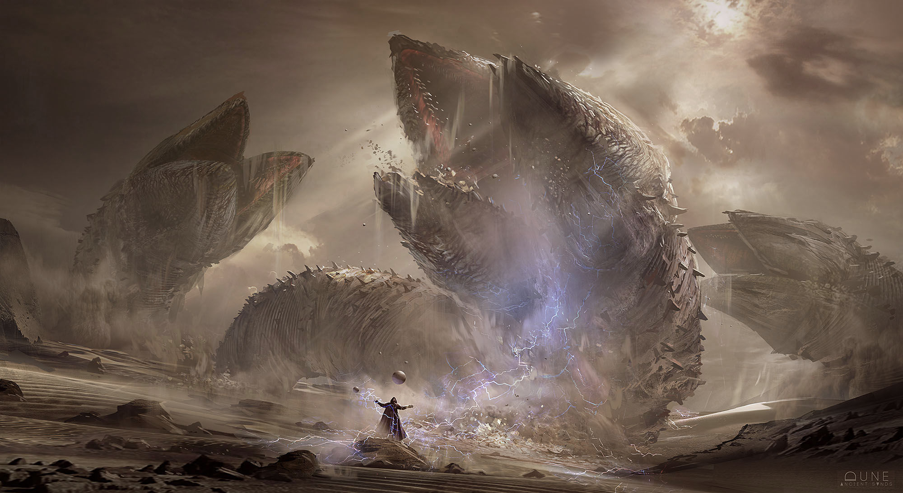

## 002 - Plan of attack

TO-DO LIST - what I have to master to achieve my goal

- Javascript (HTML/CSS)
- React & Vue
- NodeJS (Express)
- Github
- Boostrap
- VIM
- Markdown
- Google analitics
- Machine learning
- Python (Django, Flask, etc)

TO-BE LIST - what I have to do to become what I want

- Buy a domain
- Make a Site
- Make a Blog - write a post once a week
- Find a mentor
- Github - upload projects periodically to build a substantial portfolio
- Linkedin - update regularly
- Realize a logo
- Learn, learn, learn and learn.

Stay tuned!

> Roberto
